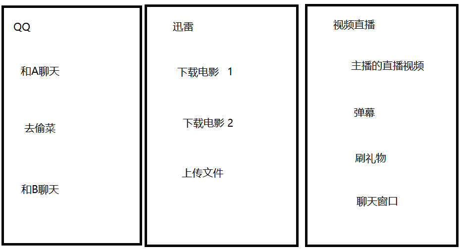
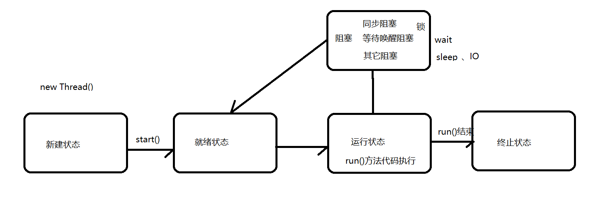
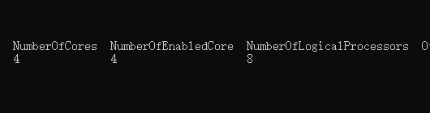
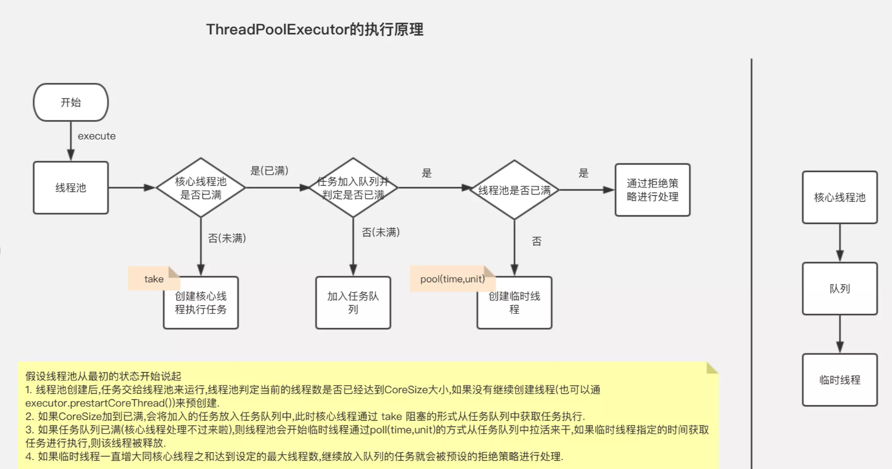

## 0.公开课内容

### 多线程基础回顾

### 线程的生命周期

### Java线程池体系架构

### Java线程池的运行原理

### 线程池源码的深度解析


## 1.并发编程之多线程基础

### 1.1 线程与进程区别

```
进程：是执行中一段程序，即一旦程序被载入到内存中并准备执行，它就是一个进程。进程是表示资源分配的的基本概念，又是调度运行的基本单位，是系统中的并发执行的单位。

线程：单个进程中执行中每个任务就是一个线程。线程是进程中执行运算的最小单位。

一个线程只能属于一个进程，但是一个进程可以拥有多个线程。多线程处理就是允许一个进程中在同一时刻执行多个任务。
```



### 1.2 多线程创建方式

#### 1.2.1.继承Thread类

```java
/**
 * 使用继承Thread 方式创建线程池
 * @作者 itcast
 * @创建日期 2020/3/18 15:31
 **/
public class Thread02_create01 {
    public static void main(String[] args) {
        // 创建线程对象
        MyThread myThread = new MyThread();
        // 启动线程
        myThread.start();
    }
    // 继承Thread类  实现run方法
    static class MyThread extends Thread{
        @Override
        public void run() {
            for (int i = 0; i < 1000; i++) {
                System.out.println("输出打印"+i);
            }
        }
    }
}
```

```
思考:调用start方法和调用run方法分别代表什么?
```

#### 1.2.2.实现Runnable接口

```java
/**
 * 使用实现Runnable接口方式
 * 创建线程
 * @作者 itcast
 * @创建日期 2020/3/18 15:31
 **/
public class Thread03_create02 {
    public static void main(String[] args) {
        // 创建线程对象   传入要执行的任务
        Thread thread = new Thread(()->{
            // do something
        });
        // 调用线程.start方法
        thread.start();
    }
    // 实现Runnable接口  实现run方法
    static class MyRunnable implements Runnable {
        @Override
        public void run() {
            for (int i = 0; i < 1000; i++) {
                System.out.println("输出:"+i);
            }
        }
    }
}
```

**使用匿名内部类**

```java
public static void main(String[] args) {
        //使用匿名内部类方式创建Runnable实例
        Thread t1 = new Thread(new Runnable(){
            @Override
            public void run() {
                for (int i = 0; i < 1000; i++) {
                    System.out.println("输出"+i);
                }
            }
        });
        t1.start();
        // lambda 表达式简化语法
        Thread t2 = new Thread(()->{
            for (int i = 0; i < 1000; i++) {
                System.out.println("输出"+i);
            }
        });
        t2.start();
}
```

#### 1.2.3.实现Callable接口

```java
/**
 * 实现Callable的接口
 * 实现一个带返回值的任务
 * @作者 itcast
 * @创建日期 2020/3/18 15:31
 **/
public class Thread03_create03 {
    public static void main(String[] args) {
        //FutureTask包装我们的任务，FutureTask可以用于获取执行结果
        FutureTask<Integer> ft = new FutureTask<>(new MyCallable());

        //创建线程执行线程任务
        Thread thread = new Thread(ft);
        thread.start();
        try {
            //得到线程的执行结果
            Integer num = ft.get();
            System.out.println("得到线程处理结果:" + num);
        } catch (InterruptedException e) {
            e.printStackTrace();
        } catch (ExecutionException e) {
            e.printStackTrace();
        }
    }
    // 实现Callable接口，实现带返回值的任务
    static class MyCallable implements Callable<Integer> {
        @Override
        public Integer call() throws Exception {
            int num = 0;
            for (int i = 0; i < 1000; i++) {
                System.out.println("输出"+i);
                num += i;
            }
            return num;
        }
    }
}
```

```
思考：
当我们启动一个线程后，
这个线程的run方法什么时候会被执行？
会被谁来执行？
当多个线程都被启动时，它们是否可以同时被运行？
```

### 1.3 多线程运行状态及生命周期

**线程的状态**

```
新建状态 (NEW)
	当用new操作符创建一个线程时， 例如new Thread(r)，线程还没有开始运行，此时线程处在新建状态。 当一个线程处于新生状态时，程序还没有开始运行线程中的代码
就绪状态 
	一个新创建的线程并不自动开始运行，要执行线程，必须调用线程的start()方法。当线程对象调用start()方法即启动了线程，start()方法创建线程运行的系统资源，并调度线程运行run()方法。当start()方法返回后，线程就处于就绪状态。
	处于就绪状态的线程并不一定立即运行run()方法，线程还必须同其他线程竞争CPU时间，只有获得CPU时间才可以运行线程。因为在单CPU的计算机系统中，不可能同时运行多个线程，一个时刻仅有一个线程处于运行状态。因此此时可能有多个线程处于就绪状态。对多个处于就绪状态的线程是由运行时系统的线程调度程序(*thread scheduler*)来调度的。
运行状态 (RUNNABLE)
	当线程获得CPU时间后，它才进入运行状态，真正开始执行run()方法.
阻塞状态 (WAITING)(TIMED_WAITING)(BLOCKED)
	线程运行过程中，可能由于各种原因进入阻塞状态:
		1>线程通过调用sleep方法进入睡眠状态；
		2>线程调用一个在I/O上被阻塞的操作，即该操作在输入输出操作完成之前不会返回到它的调用者；
		3>线程试图得到一个锁，而该锁正被其他线程持有；
		4>线程在等待某个触发条件；
死亡状态 (TERMINATED)
	有两个原因会导致线程死亡：
		1) run方法正常退出而自然死亡，
		2) 一个未捕获的异常终止了run方法而使线程猝死。
为了确定线程在当前是否存活着（就是要么是可运行的，要么是被阻塞了），需要使用isAlive方法。如果是可运行或被阻塞，这个方法返回true； 如果线程仍旧是new状态且不是可运行的， 或者线程死亡了，则返回false.
```

**线程的生命周期**



```
通过线程的生命周期，我们可以看到，当线程处于就绪的状态等待CPU的调用执行，那么当多个线程都处于就绪状态时，它们会被同时调用执行吗?

我们的CPU处理器有内核线程的概念，
比如：
单核单线程 
代表计算机的CPU有一个核心内核，同一时间只能执行一个线程任务

4核8线程：
代表计算机的CPU有4个核心内核，每个内核同一时间能执行两个线程任务


那如果我们在单核单线程的情况下，创建了多个线程的时候，CPU处理器该如何执行这些线程任务呢?

通过JVM的线程调度机制！！！

所有的Java虚拟机都有一个线程调度器，用来确定哪个时刻运行那个线程。

线程调度器: 抢占式线程调度  和  协调式线程调度


在抢占模式下，操作系统负责分配ＣＰＵ时间给各个进程，一旦当前的进程使用完分配给自己的ＣＰＵ时间，操作系统将决定下一个占用ＣＰＵ时间的是哪一个线程。因此操作系统将定期的中断当前正在执行的线程，将ＣＰＵ分配给在等待队列的下一个线程。所以任何一个线程都不能独占ＣＰＵ。每个线程占用ＣＰＵ的时间取决于进程和操作系统。进程分配给每个线程的时间很短,以至于我们感觉所有的线程是同时执行的。实际上,系统运行每个进程的时间有2毫秒,然后调度其他的线程。它同时他维持着所有的线程和循环,分配很少量的ＣＰＵ时间给线程。线程的的切换和调度是如此之快,以至于感觉是所有的线程是同步执行的。
```


### 1.4 使用多线程面临的问题

```
思考:通过创建多个线程，可以让我们的程序 “同时”执行多个任务，那么如果我们项目当中出现大量要处理任务时，我们创建多个线程去执行不就好了吗？

使用多线程开发一定要考虑两个问题:
	并发线程安全问题(这里不讨论)
	性能问题
		线程的创建和维护都需要消耗额外的系统资源，如果创建了大量的线程，而每个线程执行很短的任务， 那就得不偿失了
		
		一个CPU内核在同一时间只能运行一个线程任务，在处理多个线程时，需要在线程间进行上下文切换

如何合理的使用线程呢?
	
CPU 4核8线程
100万任务  => 8个线程

这样即可以提升程序的运行效率，又能够充分利用计算机的资源，通过又不会给计算机带来额外多的压力。


唯一的问题，就是说好说，代码不好写
```

**查看CPU内核线程数:**

开始菜单->运行->cmd->输入 wmic->输入 cpu get *



## 2 并发编程之J.U.C - 线程池

### 2.1 java中的线程池

```
线程池是为突然大量爆发的线程设计的，通过有限的几个固定线程为大量的操作服务，通过对线程的复用减少了创建和销毁线程所需的时间，从而提高效率。

合理地使用线程池能够带来3个好处：
第一：降低资源消耗。通过重复利用已创建的线程降低线程创建和销毁造成的消耗。
第二：提高响应速度。当任务到达时，任务可以不需要等到线程创建就能立即执行。
第三：提高线程的可管理性。线程是稀缺资源，如果无限制地创建，不仅会消耗系统资源，还会降低系统的稳定性，使用线程池可以进行统一分配、调优和监控。
```

### 2.2  线程池体系结构

```
线程池的体系结构：
java.util.concurrent.Executor 负责线程的使用和调度的根接口
		|--ExecutorService 子接口： 线程池的主要接口
				|--ThreadPoolExecutor 线程池的实现类
				|--ScheduledExceutorService 子接口： 负责线程的调度
					|--ScheduledThreadPoolExecutor : 继承ThreadPoolExecutor，实现了ScheduledExecutorService
	
    
    
工具类 ： Executors 提供快捷的创建线程池的方法

```

| 关键类或接口                       | 含义                                                         |
| ---------------------------------- | ------------------------------------------------------------ |
| **Executor**                       | 是一个接口，它是Executor框架的基础，<br>它将任务的提交与任务的执行分离开来 |
| **ExecutorService**                | 线程池的主要接口,是Executor的子接口                          |
| **ThreadPoolExecutor**             | 是线程池的核心实现类，用来执行被提交的任务                   |
| **ScheduledThreadPoolExecutor**    | 另一个关键实现类，可以进行延迟或者定期执行任务。ScheduledThreadPoolExecutor比Timer定时器更灵活，<br>功能更强大 |
| Future接口与FutureTask实现类       | 代表异步计算的结果                                           |
| Runnable接口和Callable接口的实现类 | 都可以被ThreadPoolExecutor或<br>ScheduledThreadPoolExecutor执行的任务 |
| **Executors**                      | 线程池的工具类，可以快捷的创建线程池                         |

**Executor**

```
线程池就是线程的集合，线程池集中管理线程，以实现线程的重用，降低资源消耗，提高响应速度等。线程用于执行异步任务，单个的线程既是工作单元也是执行机制，从JDK1.5开始，为了把工作单元与执行机制分离开，Executor框架诞生了，它是一个用于统一创建任务与运行任务的接口。框架就是异步执行任务的线程池框架。
```

**ThreadPoolExecutor**

```
Executor框架的最核心实现是ThreadPoolExecutor类，通过传入不同的参数，就可以构造出适用于不同应用场景下的线程池，那么它的底层原理是怎样实现的呢，下面就来介绍下ThreadPoolExecutor线程池的运行过程。
```

**核心构造器参数**

| 组件                         | 含义                                                         |
| ---------------------------- | ------------------------------------------------------------ |
| **int corePoolSize**         | 核心线程池的大小                                             |
| **int maximumPoolSize**      | 最大线程池的大小                                             |
| **BlockingQueue workQueue**  | 用来暂时保存任务的工作队列                                   |
| **RejectedExecutionHandler** | 当ThreadPoolExecutor已经关闭或ThreadPoolExecutor已经饱和时(达到了最大线程池的大小且工作队列已满)，execute()方法将要调用的Handler |
| long keepAliveTime,          | 表示空闲线程的存活时间。                                     |
| TimeUnit                     | 表示keepAliveTime的单位。                                    |
| ThreadFactory threadFactory  | 指定创建线程的线程工厂                                       |

**线程池的三种队列**

**1.SynchronousQueue**

```
SynchronousQueue没有容量，是无缓冲等待队列，是一个不存储元素的阻塞队列，会直接将任务交给消费者，必须等队列中的添加元素被消费后才能继续添加新的元素。
使用SynchronousQueue阻塞队列一般要求maximumPoolSizes为无界，避免线程拒绝执行操作。
```

**2.LinkedBlockingQueue**

```
LinkedBlockingQueue是一个无界缓存等待队列。当前执行的线程数量达到corePoolSize的数量时，剩余的元素会在阻塞队列里等待。（所以在使用此阻塞队列时maximumPoolSizes就相当于无效了），每个线程完全独立于其他线程。生产者和消费者使用独立的锁来控制数据的同步，即在高并发的情况下可以并行操作队列中的数据。
```

**3.ArrayBlockingQueue**

```
ArrayBlockingQueue是一个有界缓存等待队列，可以指定缓存队列的大小，当正在执行的线程数等于corePoolSize时，多余的元素缓存在ArrayBlockingQueue队列中等待有空闲的线程时继续执行，当ArrayBlockingQueue已满时，加入ArrayBlockingQueue失败，会开启新的线程去执行，当线程数已经达到最大的maximumPoolSizes时，再有新的元素尝试加入ArrayBlockingQueue时会报错。
```

```java
public static void main(String[] args) {
        BlockingQueue<Integer> queue = new SynchronousQueue<>();
        //生产者线程
        Thread t1 = new Thread(()->{
            for (int i=0;i<20;i++){
                try {
                    System.out.println("装入数据:" + i);
                    queue.put(i);
                } catch (InterruptedException e) {
                    e.printStackTrace();
                }
            }
        });
        //消费者线程
        Thread t2 = new Thread(()->{
            while (true){
                try {
                    System.out.println("2秒后取数据");
                    Thread.sleep(2000);
                } catch (InterruptedException e) {
                    e.printStackTrace();
                }
                try {
                    System.out.println(queue.take());
                } catch (InterruptedException e) {
                    e.printStackTrace();
                }
            }
        });
        t1.start();
        t2.start();
    }
```

### 2.3 线程池原理剖析

**案例代码**

```java
/**
 * 创建一个线程
 * 通过对任务的执行
 * 演示线程池的运行原理
 * @作者 itcast
 * @创建日期 2020/3/17 9:27
 **/
public class ThreadPoolDemo05{
    public static volatile boolean flag = true;
    public static void main(String[] args) {
        ThreadPoolExecutor executor = new ThreadPoolExecutor(
                2,
                5,
                10,
                TimeUnit.SECONDS,
                new ArrayBlockingQueue<Runnable>(10),
                Executors.defaultThreadFactory(),
                new ThreadPoolExecutor.DiscardOldestPolicy());
        for (int i = 0; i < 20; i++) {
            try {
                // 循环执行 20个任务    
                executor.execute(new MyRunnable("第"+(i+1)+"号线程"));
            } catch (Throwable e) {
                System.out.println("丢弃任务: " + (i+1) );
            }
        }
        // 用于演示效果
        new Thread(()->{
            // 接收控制台参数
            Scanner scanner = new Scanner(System.in);
            while (scanner.hasNext()){
                String s = scanner.nextLine();
                // 如果控制输入stop 将flag设置false, 所有任务都会执行完毕
                if ("stop".equals(s)){
                    flag = false;
                }
                if("show".equals(s)){
                    System.out.println("活跃线程数量==>"+executor.getActiveCount());
                }
            }
        }).start();
    }
    static class MyRunnable implements Runnable{
        private String name;
        public MyRunnable(String name) {
            this.name = name;
        }
        @Override
        public void run() {
            System.out.println(name);
            while (flag){
                //flag是一个开关，为true时线程任务会一直执行让线程一直执行
            }
        }
    }
}
```




```
提交一个任务到线程池中，线程池的处理流程如下：

流程1 判断核心线程数
判断正在运行的工作线程是否小于 设置的核心线程数，小于尝试创建一个
新的工作线程，如果不小于进入下一流程


流程2 判断任务队列
判断当前线程池的任务队列是否已满,未满的话将任务加入任务队列,如果满了,进入下一个流程


流程3 判断最大线程数
判断当前线程池的工作线程是否小于 设置的最大线程数，小于尝试创建一个新的临时工作线程，如果不小于进入下一流程


流程4 判断 饱和/拒绝 策略			
到此流程，说明当前线程池已经饱和，需要进行拒绝策略,根据设置的拒绝策略进行处理
```

### 2.4 线程池源码解析

**ThreadPoolExecutor源码分析**

在线程池的实现中，Worker这个类是线程池的内部类，Worker对象是线程池实现的核心。在ThreadPoolExecutor中存放了一个

```
// 工作线程的集合
HashSet<Worker> workers = new HashSet<Worker>();
```

点进Worker类的源码中 发现Worker实现了Runnable接口，并且有两个属性一个线程对象，还有一个第一次要执行的任务

```java
private final class Worker
        extends AbstractQueuedSynchronizer
        implements Runnable

{
		// 执行工作的线程对象
        final Thread thread;
		// Worker要执行的第一个任务
        Runnable firstTask;
}
```

**查看Worker的构造方法**

```java
Worker(Runnable firstTask) {
            setState(-1); 
    		// 传入worker第一次要执行的任务
            this.firstTask = firstTask;
    		// 使用工厂对象创建线程, 并把worker本身传入
            this.thread = getThreadFactory().newThread(this);
}
```

**查看线程工厂对象的newThread类方法**

```java
public Thread newThread(Runnable r) {
    // new 了一个新的线程对象  并且把worker对象作为线程任务传入
            Thread t = new Thread(group, r,
                                  namePrefix + threadNumber.getAndIncrement(),
                                  0);
            return t;
}
```

**查看Worker类当中的run方法:**

```java
// 线程任务 run方法
public void run() {
   runWorker(this);
}
// Worker的核心工作方法
final void runWorker(Worker w) {
        Thread wt = Thread.currentThread();
    	// 第一次要执行的任务 赋值给task
        Runnable task = w.firstTask;
       ...
        try {
            while (task != null || (task = getTask()) != null) {
                w.lock();
					... 
                        // 执行任务的run方法
                        task.run();
                    ...
                } finally {
                	// 任务执行完毕后，清空任务判断是否包含下一个任务
                    task = null;
                    w.completedTasks++;
                    w.unlock();
                }
            }
            completedAbruptly = false;
        } finally {
            processWorkerExit(w, completedAbruptly);
        }
    }
```

**查看getTask方法如何获取任务:**

```java
private Runnable getTask() {
        boolean timedOut = false; 
        for (;;) {
            ...
            try {
                Runnable r = timed ?
                   // 下面两种方法都是在从 workQueue队列中获取任务
                    workQueue.poll(keepAliveTime, TimeUnit.NANOSECONDS) :
                    workQueue.take();
                // 将取到的任务返回
                if (r != null)
                    return r;
                timedOut = true;
            } catch (InterruptedException retry) {
                timedOut = false;
            }
        }
    }
```

```
小结:
通过上面的源码分析得出，Worker对象是线程池工作的核心，一个Worker对象代表一个工作线程， 只要Worker内的线程的start方法被调用后，我们的worker对象内的run方法被线程执行，而run方法中则不断的从任务队列中获取 任务，并调用任务的run方法来执行，这样就达到了线程复用的目的。  


那么Worker什么时候会被创建呢? 

接着分析线程池的execute执行任务的方法
```

**execute的执行源码**

```java
// execute执行方法源码分析
		public void execute(Runnable command) {
			// 任务为空抛异常
			if (command == null)
				throw new NullPointerException();
			// ctl 是 integer原子类  主要通过它记录两类信息，
			// ctl作用: 1.记录线程池状态    2.记录线程池工作线程数量 
			// workerCountOf(c):判断worker数量 
			// isRunning(c): 判断线程池状态
			// 1.如果当前worker数量小于corePoolSize  创建一个新的worker
			int c = ctl.get();
			if (workerCountOf(c) < corePoolSize) {
                // 创建worker 参数1：任务 参数2：添加核心还是临时线程
				if (addWorker(command, true))
					return;
				c = ctl.get();
			}
			// 2.尝试向任务队列中添加任务，如果添加失败进入下移流程
			if (isRunning(c) && workQueue.offer(command)) {
				// 添加成功  复查线程池状态
				int recheck = ctl.get();
				if (! isRunning(recheck) && remove(command))
					reject(command);
				else if (workerCountOf(recheck) == 0)
					addWorker(null, false);
			}
			// 3.参数2：true => 添加核心工作线程   false => 添加临时工作线程   
			else if (!addWorker(command, false))
				
				// 4. 如果添加失败，执行拒绝策略
				reject(command);
		}
```

```
总结:通过execute方法的源码，我们就已经看到了执行流程
```

**在查看addWorker的方法，看看是如何添加一个worker的**

```java
private boolean addWorker(Runnable firstTask, boolean core) {
        retry:
        for (;;) {
				...
         // wc是工作线程的数量
         // core为true 判断是否大于核心线程数量
         // core为false 判断是否大于最大线程数量
                    wc >= (core ? corePoolSize : maximumPoolSize))
                    return false;
                ...
            }
        }
		// 准备创建worker
        Worker w = null;
        try {
            // 创建worker对象，构造器内会通过线程工厂创建一个线程  并且把worker对象作为任务传入
            w = new Worker(firstTask);
            final Thread t = w.thread;
            if (t != null) {
                final ReentrantLock mainLock = this.mainLock;
                mainLock.lock();
                try {
                   ...
                   // 将worker对象 存入到workers集合
                   workers.add(w);
                   int s = workers.size();
                   if (s > largestPoolSize)
                      largestPoolSize = s;
                      workerAdded = true;
                }
                } finally {
                    mainLock.unlock();
                }
                if (workerAdded) {
                    // 启动worker内的线程
                    t.start();
                    workerStarted = true;
                }
            }
        } finally {
            if (! workerStarted)
                addWorkerFailed(w);
        }
        return workerStarted;
    }
```

```
小结:
可以看到，在execute方法中完全和我们前面将的流程一样，在addWorker方法中通过构造器创建了worker对象  并把它存入到了workers集合中，然后启动worker内线程的start方法，这样这个worker就会不断工作，不断的执行任务队列里面的任务
```


### 2.5 Executors线程池工具类

```
Executors是线程池的工具类，提供了四种快捷创建线程池的方法：
newCachedThreadPool
创建一个可缓存线程池，如果线程池长度超过处理需要，可灵活回收空闲线程，若无可回收，则新建线程。
newFixedThreadPool 
创建一个定长线程池，可控制线程最大并发数，超出的线程会在队列中等待。
newSingleThreadExecutor 
创建一个单线程化的线程池，它只会用唯一的工作线程来执行任务，保证所有任务按照指定顺序(FIFO, LIFO, 优先级)执行。
newScheduledThreadPool 创建一个定长线程池，支持定时及周期性任务执行。
```

#### newCachedThreadPool

```java
/**
     * 创建一个可缓存线程池，如果线程池长度超过处理需要，可灵活回收空闲线程，若无可回收，则新建线程。
     */
    public void fun1(){
        // 创建线程池
        ExecutorService es = Executors.newCachedThreadPool();
        // 会创建出10个线程   分别执行任务
        for (int i = 0; i < 10; i++) {
            es.execute(()->{
                for (int j = 0; j < 10; j++) {
                    try {
                        Thread.sleep(100);
                    } catch (InterruptedException e) {
                        e.printStackTrace();
                    }
                    System.out.println(Thread.currentThread().getName() + ":" + j);
                }
            });
        }
        es.shutdown();
    }
```

#### newFixedThreadPool

```java
/**
     * 创建一个定长线程池，可控制线程最大并发数，超出的线程会在队列中等待。
     */
    public void fun2(){
        // 创建线程池
        ExecutorService es = Executors.newFixedThreadPool(2);
        // 会创建出10个线程   分别执行任务
        for (int i = 0; i < 10; i++) {
            es.execute(()->{
                try {
                    Thread.sleep(400);
                } catch (InterruptedException e) {
                    e.printStackTrace();
                }
                for (int j = 0; j < 10; j++) {
                    System.out.println(Thread.currentThread().getName() + ":" + j);
                }
            });
        }
        es.shutdown();
    }
```

#### newSingleThreadExecutor

```java
/**
     * 创建一个单线程化的线程池，它只会用唯一的工作线程来执行任务，保证所有任务按照指定顺序(FIFO, LIFO, 优先级)执行
     */ 
public void fun3(){
        // 创建线程池
        ExecutorService es = Executors.newSingleThreadExecutor();
        // 会创建出10个线程   分别执行任务
        for (int i = 0; i < 10; i++) {
            es.execute(()->{
                try {
                    Thread.sleep(400);
                } catch (InterruptedException e) {
                    e.printStackTrace();
                }
                for (int j = 0; j < 10; j++) {
                    System.out.println(Thread.currentThread().getName() + ":" + j);
                }
            });
        }
        es.shutdown();
    }
```

#### newScheduledThreadPool

```java
/**
     * 创建一个定长线程池，支持延迟及周期性任务执行。延迟执行示例代码如下
     */
    public void fun4(){
        ScheduledExecutorService newScheduledThreadPool = Executors.newScheduledThreadPool(5);
        // 周期性执行任务（任务会执行多次）
        // 参数1：任务   参数2：延迟时间   参数3：每隔长时间   参数4：时间单位
        newScheduledThreadPool.scheduleAtFixedRate(()-> System.out.println("要执行的任务"), 3, 2, TimeUnit.SECONDS);
        // 延迟执行任务（任务执行一次）
        // 参数1：任务   参数2：延迟时间   参数3：时间单位
        newScheduledThreadPool.schedule(()->System.out.println("要执行的任务"), 3,TimeUnit.SECONDS);
    }
```


